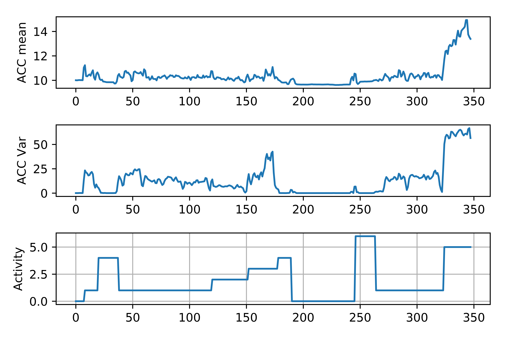

# ELEC574_Assignment2

I certify that all solutions are entirely in my words and I have credited all sources in this submission.

## References ##
[1] https://scikit-learn.org/stable/modules/generated/sklearn.ensemble.RandomForestClassifier.html

[2] The code base in ELEC 574 website: https://github.com/comp-well-org/ubicomp2020Spring/tree/master/A2_Assignment

[3] https://en.wikipedia.org/wiki/Precision_and_recall

[4] https://scikit-learn.org/stable/

[5] https://scikit-learn.org/stable/modules/generated/sklearn.decomposition.PCA.html

[6] https://docs.scipy.org/doc/scipy-0.15.1/reference/generated/scipy.stats.skew.html

[7] https://docs.scipy.org/doc/scipy-0.15.1/reference/generated/scipy.stats.kurtosis.html

## Deliverable 1 - Making Sense of the Data

**Comment on how each of the data could inform on which activity is happening. Use your plots as a reference. [15 points]**

According to the plot below:

- The activity "stationary (0) " can be indicated by the acceleration magnitude as well as barometer values. For instance, under the stationary status, the acceleration magnitude has very small fluctuations (almost "flat"). The barometer data also tends to be stable (or "flat") during the stationary activity, which is also the indicator. However, one thing we need to notice is, simply using barometer data's flat pattern to distinguish stationary won't work well, since this flat pattern also exhibits during the activity "walking-flat-surface (1)".

- The activity "walking-flat-surface (1) " is also indicated by the acceleration magnitude as well as barometer values but by different patterns. During "walking-flat-surface (1)", the acceleration magnitude starts to fluctuate, which might be captured by frequency domain features/variance features, but barometer values have almost no fluctuations. Further, even though the barometer values "stay flat", the level where they stay flat might change, see the example: the time stamp 512 - 1279 with "walking-flat-surface" (1) vs. other time stamps with "walking-flat-surface (1)".

- The activity "walking-up-stairs (2)" is indicated by: a) the acceleration magnitude's fluctuations, with the simlar level of flucations to "walking-flat-surface (1) " and b) the linear dropping of barometer values.

- The activity "Walking-down-stairs (3)" is indicated by: a) the acceleration magnitude's fluctuations, which are slightly larger than the acceleration flucations caused by "walking-up-stairs (2)" and "walking-flat-surface (1)"; b) almost the linear increasing of barometer values.

- The activity "Elevator-up (4)" is indicated by: a) the flat pattern of acceleration magnitude, and this flat pattern stays around the similiar level to the pattern caused by "stationary (0) ", which makes sense since elevator up involves no stepping movements; b) the linear dropping of barometer values.

- The activity "Running (5)" is indicated by: a) the extremely large fluctuations of the acceleration magnitude, compared to the fluctuations caused by other activities; b) the flat pattern of barometer values.

- The activity "Elevator-down (6)" is indicated by: a) the flat pattern of acceleration magnitude, and this flat pattern stays around the similiar level to the pattern caused by "stationary (0) " and "Elevator-up (4)", which also makes sense since elevator down does not involve stepping movements as well; b) the linear increasing of barometer values, as opposed to "Elevator-up (4)".

**Your task will be to compute mean and variance of acceleration for each segment. [14 points]**

Please find the implementation in the uploaded code.

**Comment on how each of the features could inform on which activity is happening. Use your plots as a reference. [15 points]**

According to the plots below:

The mean acceleration magnitude and its variance features indicate the activity in the following ways: 
- "stationary (0) ": The mean acceleration magnitude feature has very small fluctuations, staying around a small constant number (i.e., the mean acceleration magnitude value is low during this activity) and the pattern is flat (i.e., less changes); the variance feature also has very small fluctuations, staying around 0 and the pattern is flat.
- "walking-flat-surface (1)": The mean acceleration magnitude feature starts to increase and fluctuate between 10 and 12 with the values higher than the feature in "stationary (0) " period; the variance feature also starts to increase and fluctuate, which is consistent with the severe acceleration fluctuation patterns we observe in the Question 1's plot above.
- "walking-up-stairs (2)": The mean feature has similar pattern to the case "walking-flat-surface (1)", fluctuating around a similar value; the variance feature becomes more stable compared to "walking-flat-surface (1)", and fluctuates around a number between the case "stationary (0) " and the case "walking-flat-surface (1)".
- "walking-down-stairs (3)": The mean acceleration magnitude feature fluctuates with the similar pattern to the case "walking-flat-surface (1)"; the variance feature values become larger and the curve becomes sharper with a peak period, which is consistent with our observation in Question 1's plot, where walking down stairs leads to high fluctuations of original acceleration magnitude data.
- "elevator-up (4)": The mean acceleration magnitude value becomes smaller, even back to the level of activity "stationary (0) " but still some fluctuations occur; the variance value also becomes smaller getting back to almost 0, which means very few fluctuations occur for the acceleration magnitude data during this activity.
- "running (5)": Both acceleration magnitude's mean and variance features increase significantly, which means that in this activity, the acceleration magnitude values are very high and change a lot, contributing to the "noisy" pattern shown in the original acceleration magnitude data.
- "elevator-down (6)": Both mean and variance of acceleration magnitude become smaller with minute fluctuations. The variance even moves back to 0.

The acceleration magnitude power band features indicate the activity as follows: 
- "stationary (0) ": four equally-spaced band power features exhibit similar patterns - having the value around 0 and almost no fluctuation occurs.
- "walking-flat-surface (1)": four equally-spaced band power feature values become larger compared to the activity "stationary (0) " and slightly fluctuate with a few spikes. Band power can indicate frequency patterns so this observation makes sense.
- "walking-up-stairs (2)": four equally-spaced band power feature values are similar to their values in the activity "walking-flat-surface (1)" and fluctuates less compared to their patterns in the case "walking-flat-surface (1)".
- "walking-down-stairs (3)": four equally-spaced band power feature values become larger compared to their values in case "walking-flat-surface (1)" and "walking-up-stairs (2)" and fluctuate more. Looking back on the original acceleration magnitude plot in Question 1, this pattern makes sense - during this activity, the acceleration magnitude is very noisy and changes a lot with high frequency.
- "elevator-up (4)": four equally-spaced band power feature values become smaller near to 0 and stable. This is consistent with our observation that the original acceleration magnitude in this activity is not changing frequently (low frequency) and keeps relatively stable. 
- "running (5)": four equally-spaced band power feature values become larger and fluctuate a lot. This pattern makes sense since in running activity, the original acceleration magnitude changes frequently and significantly with high frequency, which is validated by this power band patterns.
- "elevator-down (6)": four equally-spaced band power feature values become smaller near to 0 and stable, with very few spikes. This can also be validated by the original acceleration magnitude plot, where original acceleration magnitude changes slightly and less frequently.

The bar slope feature indicates the activity in the following ways: 
- "stationary (0) ", "walking-flat-surface (1)", "running (5)": The bar slope has very small fluctuations around 0. There might be sharp change during the transition from one actitivy to another (e.g., from activity stationary to walking-flat-surface).
- "elevator-up (4)": The bar slope feature is negative, and fluctuates more with a peak period.
- "elevator-down (6)": The bar slope feature is positive, and fluctuates more with a peak period.
- "walking-up-stairs (2)": The bar slope has very small fluctuations but around a negative number.
- "walking-down-stairs (3)": The bar slope has very small fluctuations but around a positive number.

## Deliverable 2 - Personal-dependent Model

**Using the values in the confusion matrix to compute the precision, recall, and accuracy scores for each of the activities. [9 points]**

The code for computing these metrics are integrated into five_fold_cross_validation function. See the code.

- Model accuracy score: 87.1%
- "stationary (0) ": precision 84.4%, recall 80.6%
- "walking-flat-surface (1)": precision 83.1%, recall 90.8%
- "walking-up-stairs (2)": precision 93.8%, recall 69.8%
- "walking-down-stairs (3)": precision 96.2%, recall 96.2%
- "elevator-up (4)": precision 90.0%, recall 90.0%
- "running (5)": precision 91.7%, recall 95.7%
- "elevator-down (6)": precision 94.4%, recall 94.4%

## Deliverable 3 - Person-independent Model

**Calculate the precision, recall and accuracy scores for all activities. Compare this with the results from Deliverable 2, comment on the differences. [12 points]**

- Model accuracy score: 90.5%
- "stationary (0) ": precision 90.6%, recall 93.5%
- "walking-flat-surface (1)": precision 87.0%, recall 96.4%
- "walking-up-stairs (2)": precision 93.8%, recall 96.8%
- "walking-down-stairs (3)": precision 96.2%, recall 58.1%
- "elevator-up (4)": precision 93.3%, recall 87.5%
- "running (5)": precision 100.0%, recall 96.0%
- "elevator-down (6)": precision 88.9%, recall 100.0%

**What are the top features? [10 points]**

The feature selection output is [True True True False False False False False False False False False True True]

According to the feature extraction function, the top features are: (1) the mean magnitude of acceleration, (2) the variance of acceleration, (3) the band power aggregated within the first equal-space band, (4) the aggreated band power within frequency range 64-128, and (5) the slope of the pressure.

**Think about whether these features make sense or not. [10 points]**

According to our analyses in Deliverable 1, they all make sense. Specifically:

The figure above shows the between-subject feature visualization of mean and variance of acceleration magnitude. We find that the "flat" and "small value" patterns in the variance feature can discriminate well between "walking-flat-surface (1), stationary (0), "elevator-up (4)", "elevator-down (6)"" and other activities; its "small value" and "slight fluctuations" patterns can further distinguish "walking-up-stairs (2)" and "walking-down-stairs (3)"; its "large value" and "large fluctuations" can discriminate "running (5)". Then, using the mean acceleration magnitude can further distinguish the aforementioned subgroups selected by the variance feature. 

They are quite informative since while we do "walking-flat-surface (1), stationary (0), "elevator-up (4)", "elevator-down (6)"", the accelearation magnitude won't change a lot and significantly compared to other activities. Running (5) is the most "drastic" activity so it can also be easily represented by mean and variance features. Walking up (2) and down (3) stairs can affect the accelearation magnitude readings but cannot significantly affect them, so "small value" and "slight fluctuations" is a good feature description as well.

The figure above shows the between-subject feature visualization of two band power features. The top is the aggregated band power computed from the first equal-spaced frequency band and the bottom is the aggregated band power within the frequency 64-128. These two features exhibit similar patterns in discriminating different activities, but both informative. For example, 
The "large value" and "large fluctuations" patterns can discriminate "running (5)" from others. The "small value" and "medium fluctuations" patterns can distinguish "walking-up-stairs (2)" and "walking-down-stairs (3)". The "flat" and "small value" patterns can distinguish "stationary (0), walking-flat-surface (1), "elevator-up (4)", "elevator-down (6)". They are also informative since running (5) is a very intense activity, "walking-up-stairs (2)" and "walking-down-stairs (3)" are less intense, and the "stationary (0), walking-flat-surface (1), "elevator-up (4)", "elevator-down (6)" activities have the lowest intensity. This pattern is fully reflected by the band power's "high/low value" and "more/less fluctuations" as mentioned.

The figure above is the between-subject feature visualization of the barometer slope feature. It is also an informative feature, specifically under different activities:

- "stationary (0) ", "walking-flat-surface (1)": The bar slope has negligible fluctuations and is near to 0. It makes sense this the pressue won't change a lot during these activities.
- "walking-up-stairs (2)": The bar slope decreases a lot and is negative (it should be); the feature also has fluctuations with small spikes. It makes sense since walking up should make the pressure decrease a lot.
- "walking-down-stairs (3)": The bar slope increases a lot and is positive; there are also fluctuations with spikes. It also makes sense, similar to the case "walking-up-stairs (2)" but with opposite directions. 
- "elevator-up (4)": The bar slope fluctuates a lot with spikes and is negative, which is consistent with the case "walking-up-stairs (2)" and common sense, where moving up correspond to decreasing barometer values.
- "elevator-down (6)": The bar slope fluctuates a lot with spikes and is positive. It makes sense since the pattern is similar to the case "elevator-up (4)" but with opposite directions (it should be).

**Discuss which other sensors and features help classifying these activities more accurately. [15 points]**

We can make use of the additional sensor data available from the smartphones to enhance this classification model. For example, we can extract the rotational information from **gyroscope** data, such as pitch, yaw and roll to improve our model. This rotational inforamtion can enable fine-grained solutions to distinguish different walking behaviors. Also, the **magnetometer** data will be a good indicator of user walking directions, which will definitely help in discriminating different walking behaviors as well. Moreover, the **smartphone front-facing camera** will be a good sensor for this problem. If we ask the experimenter to hold the smartphone in a fixed manner, the captured videos can give us useful clues to walking directions, stationary or not information, and etc.

In terms of new features, except mean and variance of the acceleration magnitude, we may compute **other statistics for the acceleration, such as skewness, kurtosis** to better describe the acceleration magnitude's distribution. We won't know which metric can be a good feature beforehand, so extracting as many features as possible will be a good idea.

Another category of feature I can come up with is the **"synthesized feature", such as the features formed from PCA**. As mentioned, we can extract as many features as possible but they may be highly correlated. So we should further "preprocess" them to obtain new, synthesized, uncorrelated, and informative features. The feature set extracted by PCA is one example. Another example can be **the features obtained from pretrained neural networks**, such as autoencoders, by feeding our extracted features into these networks. 

I believe the aforementioned sensors and features can help improve our current model. 

**BONUS POINT (+50 points) Try classifying activities using 2 other different algorithms and compare the classification performance using precision, recall, and accuracy scores. Discuss which algorithm performs better than others.**

- Algorithm 1: The same feature set + Random Forest Classifier (parameters: # estimator = 50, max_depth=5) [1].

The implementation is based on [1]. The idea of using Random Forest is that decision tree models can represent very limited non-linear patterns. As per our observation of the extracted features, they are informative for different activities but not fully linearly informative. So the decision tree model might not be sufficient. Random Forest creates bootstrapping dataset then selects while building each individual tree [1], which has stronger representation power of non-linearity. The result is as the following:

**Person-dependent model**
-  Accuracy score: 86.8%
- "stationary (0) ": precision 87.5%, recall 84.8%
- "walking-flat-surface (1)": precision 94.8%, recall 82.0%
- "walking-up-stairs (2)": precision 84.4%, recall 96.4%
- "walking-down-stairs (3)": precision 34.6%, recall 100.0%
- "elevator-up (4)": precision 86.7%, recall 89.7%
- "running (5)": precision 100.0%, recall 100.0%
- "elevator-down (6)": precision 77.8%, recall 100.0%

**Person-independent model**
-  Accuracy score: 88.2%
- "stationary (0) ": precision 93.8%, recall 83.3%
- "walking-flat-surface (1)": precision 98.7%, recall 86.9%
- "walking-up-stairs (2)": precision 93.8%, recall 85.7%
- "walking-down-stairs (3)": precision 38.5%, recall 100.0%
- "elevator-up (4)": precision 80.0%, recall 96.0%
- "running (5)": precision 100.0%, recall 100.0%
- "elevator-down (6)": precision 38.9%, recall 100.0%

- Algorithm 2: The extended feature set + PCA (to 10-dimensional components) + Decision Tree Classifier

In this method, we increase the original feature set to 14-dimensional, adding skewness and kurtosis as additional features to describe acceleration distribution patterns. The key idea is to increase the dimension of features, followed by the PCA dimensionality reduction (to 10 principle components that account for over 99% of variance) to reduce the correlated features to select a better feature set. The implementation is based on [5, 6, 7]. We still use the decision tree classifier, the same as the original codes provide. The result is as the following:

**Person-dependent model**
-  Accuracy score: 68.4%
- "stationary (0) ": precision 76.6%, recall 87.5%
- "walking-flat-surface (1)": precision 77.9%, recall 83.9%
- "walking-up-stairs (2)": precision 37.5%, recall 40.0%
- "walking-down-stairs (3)": precision 57.7%, recall 41.7%
- "elevator-up (4)": precision 46.7%, recall 37.8%
- "running (5)": precision 95.8%, recall 100.0%
- "elevator-down (6)": precision 27.8%, recall 21.7%

**Person-independent model**
-  Accuracy score: 88.2%
- "stationary (0) ": precision 93.8%, recall 83.3%
- "walking-flat-surface (1)": precision 98.7%, recall 86.9%
- "walking-up-stairs (2)": precision 93.8%, recall 85.7%
- "walking-down-stairs (3)": precision 38.5%, recall 100.0%
- "elevator-up (4)": precision 80.0%, recall 96.0%
- "running (5)": precision 100.0%, recall 100.0%
- "elevator-down (6)": precision 38.9%, recall 100.0%

To sum up, we find that the original method outperforms the two new algorithms I proposed. I think the reason should be: this classification problem does not need complex non-linear models, and the original feature engineering already captures the informative patterns in sensor data. Adding more features or non-linearity to the model will confuse the classifier instead of improving it. A lesson I learnt from this algorithm exploration is - always start from simple and less non-linear models, and focus more on feature engineering and analysis. Only in this way, the model learnt will make sense and capture the key patterns within the original data.
